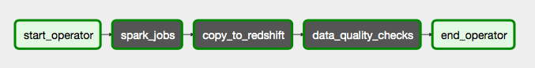
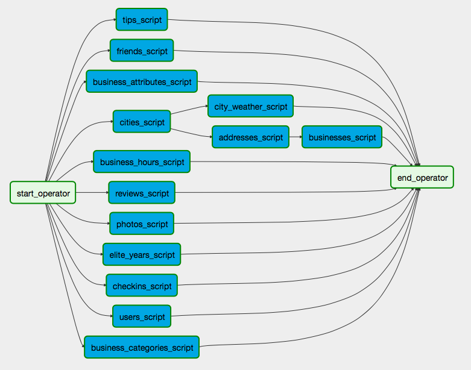
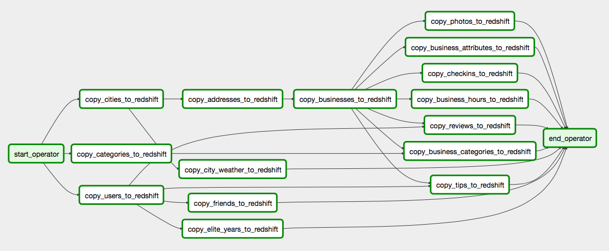
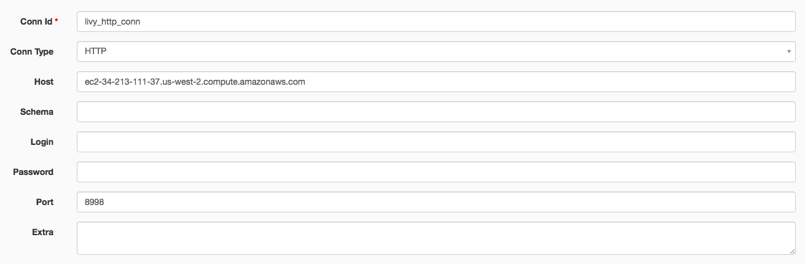
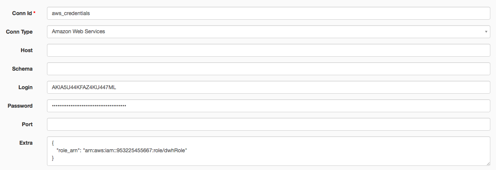
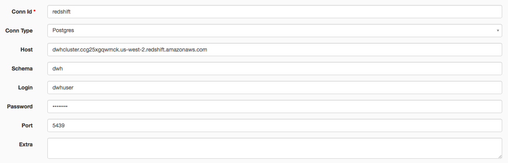

# INTRODUCCIÓN

El flujo de datos desarrollado, transforma el set de datos No-Relacional de Yelp, distribuido en archivos JSON los cuales son almacenados en un bucket de Amazon S3 en un set de datos normalizado 3NF, almacenado en Amazon Redshift. El esquema resultante garantiza la coherencia de los datos y la integridad referencial entre las tablas, y está destinado a ser la fuente de verdad para las consultas analíticas y las herramientas de BI. Además, los datos se enriquecieron con datos demográficos y meteorológicos procedentes de fuentes de datos de terceros. 

Todo el proceso se realizó utilizando Apache Spark, Amazon Redshift y Apache Airflow.

## SET DE DATOS


El [Set de Datos de Yelp](https://www.yelp.com/dataset) es el candidato perfecto para este proyecto, ya que:
- (1) Es una fuente de datos NoSQL.
- (2) Consta de 6 ficheros que suman más de 10 millones de filas.
- (3) Este conjunto de datos proporciona mucha información diversa y permite muchos enfoques de análisis, desde las consultas analíticas tradicionales, hasta la Minería de Gráficos, la Clasificación de Fotos, el Procesamiento del Lenguaje Natural y el Análisis de Sentimientos.

Para que la contribución fuera única, el conjunto de datos de Yelp se enriqueció con datos demográficos y meteorológicos. Esto permite al usuario final hacer consultas como "*¿Depende el número de valoraciones de la densidad de población de la ciudad?*" o "*¿Qué restaurantes son especialmente populares cuando hace calor?*".

### SET DE DATOS DE YELP

El conjunto de datos [Yelp Dataset](https://www.yelp.com/dataset/download) es un subconjunto de negocios, reseñas y datos de usuarios de Yelp, disponible para uso académico. El conjunto de datos (a fecha de 13.08.2019) ocupa 9 GB de espacio en disco (descomprimido) y cuenta con 6.685.900 reseñas, 192.609 negocios en más de 10 áreas metropolitanas, más de 1,2 millones de atributos de negocios como horarios, aparcamiento, disponibilidad y ambiente, 1.223.094 propinas de 1.637.138 usuarios y check-ins agregados a lo largo del tiempo. Cada archivo se compone de un único tipo de objeto, un objeto JSON por línea. Para más detalles sobre
la estructura del conjunto de datos, consulte [Documentación JSON del conjunto de datos de Yelp](https://www.yelp.com/dataset/documentation/main).

### DATOS DEMOGRÁFICOS DE LAS CIUDADES DE EE.UU.

Los [Datos Demográficos de las Ciudades de EE.UU.](https://public.opendatasoft.com/explore/dataset/us-cities-demographics/export/) contiene información sobre la demografía de todas las ciudades y lugares designados por el censo de EE.UU. con una población superior a 1.000 habitantes o igual a 65.000. Estos datos proceden de la Encuesta sobre la Comunidad Estadounidense 2015 de la Oficina del Censo de Estados Unidos. Cada objeto JSON describe los datos demográficos de una ciudad y una raza concretas, por lo que puede identificarse de forma unívoca mediante los campos de ciudad, estado y raza. Puede encontrar más información
[aquí](https://public.opendatasoft.com/explore/dataset/us-citiesdemographics/information/) en la sección "Dataset schema".

### DATOS METEOROLÓGICOS HISTÓRICOS POR HORA 2012-2017

Los [Datos Meteorológicos Históricos por Hora](https://www.kaggle.com/datasets/selfishgene/historical-hourly-weather-data?resource=download) es un set de datos recopilados por un competidor de Kaggle. El conjunto de datos contiene 5 años de mediciones horarias de diversos atributos meteorológicos, como la temperatura, la humedad y la presión atmosférica. Estos datos están disponibles para 27 grandes ciudades de EE.UU., 3 ciudades de Canadá y 6 ciudades de Israel. Cada atributo tiene su propio archivo y está organizado de forma que las filas son el eje temporal (marcas de tiempo) y las columnas son las distintas ciudades. Además, hay un archivo separado para identificar qué ciudad pertenece a qué país.

## MODELO Y DICCIONARIO DE DATOS

Nuestro modelo de datos objetivo es un modelo relacional normalizado 3NF, que fue diseñado para ser neutral a diferentes tipos de consultas analíticas. Los datos deben depender de la clave [1NF], de toda la clave [2NF] y de nada más que la clave [3NF]. Las formas más allá de 4NF son principalmente de interés académico. 

La siguiente imagen muestra el modelo lógico de la base de datos:

[Modelo de Datos](images/Modelo-Datos.png)

Nota: Los campos como *compliment_* son sólo marcadores de posición para múltiples campos con el mismo prefijo (*compliment*). Esto se hace para reducir visualmente la longitud de las tablas.

El modelo consta de 15 tablas como resultado de normalizar y unir 6 tablas proporcionadas por Yelp, 1 tabla con información demográfica y 2 tablas con información meteorológica. El esquema se acerca más a un esquema Snowflake, ya que hay dos tablas de hechos - *reviews* y *tips* - y muchas tablas  dimensionales con múltiples niveles de jerarquía y relaciones de muchos a muchos. Algunas tablas conservan sus claves nativas, mientras que para otras se han generado identificadores monótonamente crecientes. Regla de oro: Utilice claves generadas para las entidades y claves compuestas para las relaciones. Además, las marcas de tiempo y las fechas se convirtieron a los tipos de datos nativos de Spark para poder importarlas a Amazon Redshift en un formato correcto.

Para obtener más información sobre tablas y campos, visite [Yelp Dataset JSON](https://www.yelp.com/dataset/documentation/main) o consulte [Redshift table definitions](https://github.com/juand1925/yelp-dataset-spark/blob/master/airflow/dags/configs/table_definitions.yml).

Para profundizar en el pipeline de procesamiento de datos con Spark, aquí está [Jupyter Notebook](https://nbviewer.jupyter.org/github/juand1925/yelp-dataset-spark/blob/master/spark-jobs-playground.ipynb).

#### *negocios*

La tabla más consultada del modelo. Contiene el nombre del negocio, la calificación actual con estrellas, el número de opiniones y si el negocio está abierto en ese momento. La dirección (relación uno a uno), el horario (relación uno a uno), los atributos de los negocios (relación uno a uno) y las categorías (relación uno a muchos) se externalizaron a tablas independientes como parte del proceso de normalización.

#### *atributos_empresariales*

Esta fue la parte más complicada de la remodelación, ya que Yelp guardaba los atributos de las empresas como dict anidados. Todos los campos de la tabla de origen eran cadenas, por lo que había que convertirlos en sus respectivos tipos de datos. Algunos valores estaban sucios, por ejemplo, los campos booleanos pueden ser `"True"`, `"False"`,
`"None"` y `None`, mientras que algunos campos de cadena tenían formato unicode doble `u "u'string'"`. Además, algunos campos eran dicts formateados como cadenas. La estructura JSON anidada de tres niveles resultante debía aplanarse.

#### *categorías_de_negocio* y *categorías*.

En la tabla original, las categorías de negocio se almacenaban como una matriz. La mejor solución era externalizarlas en una tabla independiente. Una forma de hacerlo es asignar una columna a cada categoría, pero ¿y si vamos a añadir una nueva categoría más adelante? Entonces debemos actualizar toda la tabla para reflejar el cambio, lo que supone una clara violación de la 3NF, según la cual las columnas no deben tener relaciones de función transitorias. Así pues, creemos dos tablas: *categories*, que contiene categorías codificadas por sus ids, y *business_categories*, que
contiene tuplas de ids de negocio e ids de categoría.

#### *horario_comercial*

Los horarios comerciales se almacenaban como un dict en el que cada clave es el día de la semana y el valor es una cadena con el formato `"hora:minuto-hora:minuto"`. La mejor forma de hacer que la representación de los datos sea neutral para las consultas es dividir las partes "desde la hora" y "hasta la hora" en columnas separadas y combinar
"hora" y "minuto" en un único campo de tipo entero, por ejemplo `"10:00-21:00"` en `1000` y `2100` respectivamente. De esta forma podríamos formular fácilmente la siguiente consulta:

```sql
-- Encontrar comercios abiertos el domingo a las 20:00 horas
SELECT business_id FROM business_hours WHERE Sunday_from <= 2000 AND
Sunday_to > 2000;
```
#### *direcciones*

Una práctica habitual es separar los datos comerciales de los datos de direcciones y conectarlos mediante una clave sintética. El vínculo resultante es una relación de uno a uno. Además, las direcciones se separaron de las ciudades, ya que los estados y los datos demográficos sólo dependen de las ciudades (de lo contrario, se infringe la 3NF).

#### *ciudades*

Esta tabla contiene el nombre de la ciudad y el código de estado procedentes del conjunto de datos de Yelp y campos sobre demografía. Para la mayoría de las ciudades no hay información demográfica, ya que son demasiado pequeñas (< 65k). Cada registro de la tabla puede identificarse unívocamente por la ciudad y el código postal, pero es más conveniente utilizar una única clave primaria para conectar tanto las direcciones como las ciudades.

#### *tiempo_ciudad*

La tabla *city_weather* se compuso a partir de los archivos CSV `temperature.csv` y `weather_description.csv`. Ambos archivos contienen información sobre varias ciudades (de todo el mundo). Para filtrar las ciudades por país (= EE.UU.), primero hay que leer el archivo `city_attributes.csv`. El problema con el conjunto de datos es que no nos proporciona los respectivos códigos de estado, así que ¿cómo sabemos si Phoenix está en AZ o TX? La solución más adecuada es encontrar la ciudad más grande. Esto se puede hacer manualmente con Google: encontrar los códigos de estado respectivos y luego compararlos con las ciudades disponibles en el conjunto de datos de Yelp. Como resultado, se podrían enriquecer 8 ciudades. Además, tanto las temperaturas como las descripciones meteorológicas se registraron cada hora, lo que es demasiado preciso. Así pues, se agruparon por días aplicando una estadística de agregación: las temperaturas (de tipo `float`) se promedian, mientras que para la descripción meteorológica (de tipo `string`) se elige la más frecuente.

#### *checkins*

Esta tabla contiene las entradas en una empresa y no requiere más transformaciones.

#### *reviews*

La tabla *reviews* contiene los datos completos del texto de la opinión, incluyendo el identificador del usuario que escribió la opinión y el identificador de la empresa para la que se escribió la opinión. Es la tabla más central de nuestro esquema de datos y está estructurada de forma similar a una tabla de hechos. Pero para convertirla en una tabla de hechos, hay que externalizar la columna de fecha a una tabla de dimensiones separada y omitir el texto.

#### *users*, *elite_years* y *friends*

Originalmente, los datos de usuario incluyen la asignación de amigos del usuario y todos los metadatos asociados al usuario. Pero como los campos `friends` y son matrices, se han convertido en relaciones separadas en nuestro modelo, ambas estructuradas de forma similar a la tabla *business_categories* y con claves primarias compuestas. El formato de
la tabla *friends* es muy práctico, ya que puede introducirse directamente en la API GraphX de Apache Spark para construir un gráfico social de los usuarios de Yelp.

#### *consejos*

Los consejos fueron escritos por un usuario sobre un negocio. Los consejos son más breves que las reseñas y suelen transmitir sugerencias rápidas. La tabla no requería transformaciones, aparte de asignarle una clave generada.

#### *fotos*

Contiene los datos de la foto, incluidos el pie de foto y la clasificación.

## FLUJO DE DATOS

El pipeline diseñado carga dinámicamente los archivos JSON desde S3, los procesa y almacena sus versiones normalizadas y enriquecidas de nuevo en S3 en formato Parquet. Después de esto, Redshift toma el relevo y copia las tablas en un DWH.

#### Cargar Datos desde S3


Los tres conjuntos de datos residen en un bucket de Amazon S3, que es la opción más fácil y segura para almacenar y recuperar cualquier cantidad de datos en cualquier momento desde cualquier otro servicio de AWS.

#### Procesar con Spark


Dado que los datos están en formato JSON y contienen matrices y campos anidados, primero es necesario transformarlos a un formato relacional. Por diseño, Amazon Redshift no admite la carga de datos anidados (Solo Redshift Spectrum permite consultar tipos de datos complejos como struct, array o map, sin tener que transformar o cargar los datos). Para hacer esto de forma rápida y escalable, se utiliza Apache Spark. En concreto, puede ejecutar todo el canal de procesamiento de datos en [Jupyter Notebook - ETL](https://nbviewer.jupyter.org/github/juand1925/yelp-dataset-spark/blob/master/spark-jobs-playground.ipynb) un clúster de Amazon EMR (Elastic MapReduce), que utiliza Apache Spark y Hadoop para procesar y analizar de forma rápida y rentable grandes cantidades de datos. Otra ventaja de Spark es la capacidad de controlar la calidad de los datos, por lo que la mayoría de nuestras comprobaciones de calidad de los datos
se realizan en esta fase.

#### Descargar en S3


Parquet almacena estructuras de datos anidadas en un formato plano de columnas. En comparación con un enfoque tradicional en el que los datos se almacenan en un enfoque orientado a filas, parquet es más eficiente en términos de almacenamiento y rendimiento. Los archivos parquet están bien soportados en el ecosistema de AWS. Además, en comparación con los formatos JSON y CSV, podemos almacenar objetos de fecha y hora, objetos de fecha y hora y textos largos sin ningún procesamiento posterior, y cargarlos en Amazon Redshift tal cual. A partir de aquí, podemos utilizar un Crawler de AWS Glue para descubrir y registrar el esquema de nuestros conjuntos de datos que se utilizarán en Amazon Athena. Pero nuestro objetivo es materializar los datos en lugar de realizar consultas
directamente desde archivos en Amazon S3, para poder recuperar los datos sin tiempos de carga prolongados.

#### Cargar en Redshift


Para cargar los datos de los ficheros Parquet en nuestro DWH de Redshift, podemos recurrir a múltiples opciones. La más sencilla es utilizando [Spark to Redshift](https://github.com/databricks/spark-redshift): Spark lee los archivos parquet desde S3 al cluster de Spark, convierte los datos a formato Avro, los escribe en S3 y finalmente emite una consulta COPY SQL a Redshift para cargar los datos. O podemos tener [Job de AWS Glue que cargue los datos en Amazon Redshift](https://www.dbbest.com/blog/aws-glue-etl-service/). Pero en lugar de eso, deberíamos definir las tablas manualmente: así podemos controlar la calidad y consistencia de los datos, pero también las sortkeys, distkeys y la compresión. Esta solución emite sentencias SQL a Redshift para CREAR primero las tablas y luego COPIAR los datos. Para que el proceso de definición de tablas sea más sencillo y transparente, podemos utilizar el catálogo de datos de AWS Glue para derivar los tipos de datos correctos (por ejemplo, ¿deberíamos utilizar int o bigint?).

#### Comprobar la Calidad de los Datos

La mayoría de las comprobaciones de datos se realizan al transformar los datos con Spark. Además, las comprobaciones de coherencia e integridad referencial se realizan automáticamente al importar los datos a Redshift (ya que los datos deben ajustarse a la definición de tabla). Para garantizar que las tablas de salida tienen el tamaño adecuado, también realizamos algunas comprobaciones al final de la canalización de datos.

## DAG DE AIRFLOW


El flujo de datos se ejecuta utilizando Apache Airflow, que es una herramienta para orquestar flujos de trabajo computacionales complejos y cadenas de procesamiento de datos. La ventaja de Airflow sobre los scripts ETL de Python es que proporciona muchos módulos adicionales para operadores que ya existen en la
comunidad, de forma que se pueden crear cosas útiles rápidamente y de forma modular. Además, el programador de Airflow está diseñado para ejecutarse como un servicio persistente en un entorno de producción de Airflow y es más fácil de gestionar que los cron jobs.

Todo el flujo de datos se divide en tres subDAG´s: El que procesa los datos con Spark (`spark_jobs`), el que carga los datos en Redshift (`copy_to_redshift`) y el que comprueba si hay errores en los datos (`data_quality_checks`).



### spark_jobs

Este subDAG se compone de un conjunto de tareas, cada una de las cuales envía un script Spark a un clúster de Amazon EMR. Para ello, se utiliza el [LivySparkOperator](https://github.com/rssanders3/airflow-sparkoperator- plugin). Este operador facilita la interacción con el Servidor Livy en el nodo maestro EMR, lo que nos permite enviar código Scala o Python simple a través de llamadas REST API en lugar de tener que gestionar y desplegar grandes archivos JAR. Esto ayuda porque escala fácilmente los pipelines de datos con múltiples trabajos Spark ejecutándose en paralelo, en lugar de ejecutarlos en serie utilizando la
API Step de EMR. Cada script de Spark se encarga de cargar uno o más archivos JSON de origen, transformarlos en una o más tablas (3NF normalizadas) y descargarlos de nuevo en S3 en formato parquet. El subDAG se particionó lógicamente por tablas de destino, de forma que cada script se encarga de una pequeña cantidad de trabajo para simplificar la depuración. Nota: para aumentar el rendimiento, se podrían dividir las tareas por las tablas de origen y almacenarlas en caché.



### copy_to_redshift
Airflow se encarga de cargar los archivos Parquet en Redshift en el orden correcto y con comprobaciones de coherencia. La operación de carga se realiza con el [S3ToRedshiftOperator](https://github.com/airflowplugins/redshift_plugin), proporcionado por la comunidad Airflow. Este operador toma la definición de la tabla como un diccionario, crea la tabla Redshift a partir de ella y realiza la operación COPY. Todas las definiciones de tabla se almacenan en un archivo de  configuración YAML. El orden y las relaciones entre los operadores se derivan de las referencias entre tablas; por ejemplo, dado que la tabla *reviews* hace
referencia a *businesses*, *businesses* debe cargarse en primer lugar; de lo contrario, se infringe la integridad referencial (y pueden producirse
errores). Así pues, la integridad de los datos y las restricciones referenciales se aplican automáticamente mientras se rellena la base de datos de Redshift.



### data_quality_checks

Las comprobaciones de calidad de datos se ejecutan con un [RedshiftCheckOperator] personalizado (https://github.com/juand1925/yelp-dataset-spark/blob/master/airflow/plugins/redshift_plugin/operators/redshift_check_operator.py), que amplía el [CheckOperator] predeterminado de Airflow (https://github.com/apache/airflow/blob/master/airflow/operators/check_operator.py). Toma una sentencia SQL, el valor de paso esperado y, opcionalmente, la tolerancia del resultado, y realiza una comprobación de valor simple.

## ESCENARIOS

Es necesario abordar los siguientes escenarios: 
- **Los datos se multiplicaron por 100:** Eso no sería un problema técnico, ya que tanto los clústeres de Amazon EMR como los de Redshift
pueden manejar enormes cantidades de datos. Con el tiempo, habría que escalarlos.
- **Los datos rellenan un cuadro de mando que debe actualizarse diariamente antes de las 7 de la mañana:** Esto es perfectamente plausible y podría hacerse ejecutando el script ETL algún tiempo antes de las 7 de la mañana.
- **Más de 100 personas debían acceder a la base de datos**: No sería un problema, ya que Redshift es altamente escalable y disponible.

## INSTALACIÓN

### Preparación de Datos (Amazon S3)

- Crear un bucket S3.
- Asegúrese de que el bucket se encuentra en la misma región que sus clústeres de Amazon EMR y Redshift.
- Ten cuidado con los permisos de lectura: puedes acabar pagando muchos gastos en transferencias de datos.
- Opción 1:
- Descargue [Yelp Dataset](https://www.yelp.com/dataset/download) y súbalo directamente a su bucket de S3 (carpeta `yelp_dataset`).
- Descargue el archivo JSON de [U.S. City Demographic Data](https://public.opendatasoft.com/explore/dataset/us-cities-demographics/export/)
- Súbalo a una carpeta separada (`demo_dataset`) en tu bucket de S3.
- Descargue todo el conjunto de datos de [Historical Hourly Weather Data 2012- 2017](https://www.kaggle.com/datasets/selfishgene/historical-hourly-weather-data?resource=download)
- Descomprima y cargue `city_attributes.csv`, `temperature.csv`, y `weather_description.csv` en una carpeta independiente (`weather_dataset`) de su bucket de S3.

### Amazon EMR

- Configure y cree su clúster EMR.
- Vaya a opciones avanzadas y habilite Apache Spark, Livy y AWS
Glue Data Catalog for Spark.
- Introduce el siguiente JSON de configuración para que Python 3 sea
el predeterminado:
```json
[
    {
        "Clasificación": "spark-env",
        "Configuraciones": [
            {
                "Clasificación": "exportación",
                "Propiedades": {
                    "PYSPARK_PYTHON": "/usr/bin/python3"
                }
            }
        ]
    }
]
```
- Vaya a Grupos de seguridad de EC2, seleccione su nodo maestro y habilite las conexiones entrantes a 8998.

### Amazon Redshift

- Guarde sus credenciales y los parámetros de creación del clúster en `dwh.cfg`.
- Ejecute `create_cluster.ipynb` para crear un cluster Redshift.
- Nota: Borre su cluster Redshift con `delete_cluster.ipynb` cuando haya terminado de trabajar.

### Apache Airflow

- Utilice [Inicio rápido](https://airflow.apache.org/start.html) para poner en marcha una instancia local de Airflow.
- Copie las carpetas `dags` y `plugins` en su entorno de trabajo Airflow (En la variable de ruta `AIRFLOW_HOME`).
- Crear una nueva conexión HTTP `livy_http_conn` proporcionando el host y el puerto del servidor Livy.



- Crear una nueva conexión AWS `aws_credentials` proporcionando las credenciales de usuario y el rol ARN (desde `dwh.cfg`)



- Crear una nueva conexión Redshift `redshift` proporcionando los parámetros de conexión a la base de datos (desde `dwh.cfg`)



- En la interfaz de usuario de Airflow, active y ejecute manualmente el DAG "principal".